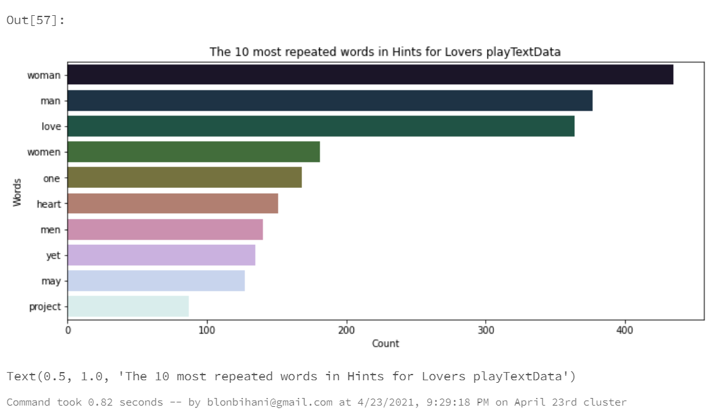

# Tamang's Big Data Final Project
PySpark Text Processing for the words used in the play 'Hints for Lovers'

## Author: Bihani Tamang
<table>
  <tr>
   <td align="center"><a href="https://github.com/blonbihani"><br /><sub><b>Bihani Tamang</b></sub></a><br /><a href="https://github.com/blonbihani" title="Code"></a></td>
  </tr>
  </table>

## Text Data Source
I took the text file for my Project's data from 

- [Hints for Lovers](https://www.gutenberg.org/cache/epub/14255/pg14255.txt)

## Steps involved:

### Get and store the data
At first, we shall request or pull the text data from given URL into the urllib library.
```
import urllib.request
stringInURL = "https://www.gutenberg.org/cache/epub/14255/pg14255.txt"
```

Then we shall store the data in temporary file and name it love.txt.
```
urllib.request.urlretrieve(stringInURL, "/tmp/love.txt")
```

We shall move the data from the temporary data to a new location using dbutils.fs.mv
```
dbutils.fs.mv("file:/tmp/love.txt","dbfs:/data/love.txt")
```

Now, we will transfer the data file into Spark by converting the data file into Spark's RDD data structure.
```
LoverawRDD = sc.textFile("dbfs:/data/love.txt")
```
### Data Cleaning

In this step, we shall use flatmapping technique to break down the data. We will change all the words into lower case using lower(), remove any spaces using strip() and split the sentences into words using split.(" ").
```
#flatmap each line to words
loveTokenRDD=LoverawRDD.flatMap(lambda line : line.lower().strip().split(" "))
```

We shall then remove any kind of punctuations (.,?,!) using the re library.
```
import re
loveCleanTokensRDD = loveTokenRDD.map(lambda w: re.sub(r'[^a-zA-Z]' , '',w))
```

Then, we will filter out stopwords using the StopwordsRemover library from pyspark.ml.feature.
```
#filter out stopwords
from pyspark.ml.feature import StopWordsRemover
remover = StopWordsRemover()
stopwords = remover.getStopWords()
loveWordsRDD = loveCleanTokensRDD.filter(lambda w: w not in stopwords)
# map words to (word,1) intermediate key value pairs
```
Optional Step: We will then remove any empty elements in our data.
```
loveWordsEmptyRemoveRDD = loveWordsRDD.filter(lambda words: words != "")
```
### Processing/Cleaning the Data
We shall convert the words in the form (words,1) and  count the number of times the word has been used. Then, we'll again change the second parameter to the count. 
```
loveWordsPairRDD = loveWordsEmptyRemoveRDD.map(lambda word: (word,1))
```

We'll store the word the first time they appear in the RDD. Second occurence onwards, it will be removed.
```
loveWordsCountRDD = loveWordsPairRDD.reduceByKey(lambda x,y: x+y)
```

At last, we'll sort the list of our words in a descending order using sortByKey() and print the top 10 most repeated words in the Hints for Love play.
```
loveWordsResults = loveWordsCountRDD.map(lambda word: (word[1],word[0])).sortByKey(False).take(10)
print(loveWordsResults)
```

## Charting
We will use Pandas, MatPlotLib and Seaborn packages to create visualization for our project.

```
import pandas as pd
import matplotlib.pyplot as plt
import seaborn as sns

source = 'TextData'
title = 'The 10 most repeated words in Hints for Lovers' + source
xlabel = 'Count'
ylabel = 'Words'

df = pd.DataFrame.from_records(loveWordsResults, columns = [xlabel,ylabel])
plt.figure(figsize=(12,5))
sns.barplot(xlabel,ylabel, data=df, palette = "cubehelix").set_title(title)
```


